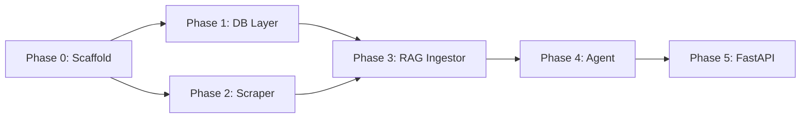

# Re:Search — Backend Execution Roadmap

## Goal

Build a **fully functional, testable Python backend** for the Re:Search AI researcher agent. The backend must be exercisable entirely from the CLI before any frontend is developed. The architecture follows the spec in the four design docs:

- A **Universal Node / Edge graph** stored in SQLite (+ `sqlite-vec` for vectors, FTS5 for keywords).
- A **RAG ingestion pipeline** (scrape → clean → chunk → embed → store).
- A **LangGraph-based Researcher Agent** that autonomously plans, searches, scrapes, and synthesises.
- A **CLI test harness** that lets you drive every pipeline from a terminal session.

> [!IMPORTANT]
> The Tauri / Rust layer described in the original docs is **deferred**. The Python backend replaces it as the initial implementation target, exposing the same logical operations via a CLI and a thin **FastAPI** HTTP layer. This gives us fast iteration without Rust compilation overhead. The Rust layer can wrap this later.

---

## Proposed Changes — Phased Execution

---

### Phase 0 — Project Scaffold ✅ COMPLETE

**Goal:** Establish a clean, reproducible project structure before writing any logic.

#### [NEW] `Search/` (project root)
```
Search/
├── docs/                    # (existing)
├── backend/
│   ├── __init__.py
│   ├── config.py            # Centralised settings (paths, model names, API keys)
│   ├── db/
│   ├── scraper/
│   ├── rag/
│   ├── agent/
│   └── api/
├── cli/
│   └── main.py              # Typer CLI entry-point
├── tests/
│   ├── test_db.py
│   ├── test_scraper.py
│   ├── test_rag.py
│   └── test_agent.py
├── requirements.txt
├── pyproject.toml           # Black, pytest, mypy config
└── README.md
```

**Files to create:**

| File | Purpose |
|---|---|
| `requirements.txt` | Pin all dependencies (versions locked) |
| `pyproject.toml` | Tool config for black, mypy, pytest |
| `backend/config.py` | `Settings` dataclass — workspace path, DB path, model choices |
| `cli/main.py` | Typer app skeleton with placeholder commands |

**Dependencies (add to `requirements.txt`):**

```
fastapi
uvicorn[standard]
typer[all]
sqlalchemy          # Used only for migration helpers; raw SQL elsewhere
langgraph
langchain-core
langchain-community
langchain-openai
langchain-ollama
httpx
trafilatura         # Readability / content extraction
playwright          # JS-rendered page fallback
pytest
pytest-asyncio
black
mypy
python-dotenv
```

> [!NOTE]
> `sqlite-vec` is installed as a Python wheel: `pip install sqlite-vec`. The extension is loaded at runtime via `sqlite3.load_extension()`.

**Validation:**
```bash
cd Search
pip install -r requirements.txt
python -c "import backend; print('scaffold ok')"
python cli/main.py --help
```

> ✅ All three validation commands pass (Python 3.13.1, pytest 4/4).

**Notes from execution:**
- `click` pinned to `>=8.1.0,<8.2.0` — click 8.2 changed `make_metavar()` signature, breaking typer 0.15.x at `--help`.
- `langchain-core` bumped to `>=0.3.75,<0.4.0` — the pinned `0.3.34` conflicted with `langgraph-prebuilt 0.6.4` (`>=0.3.67`) and the existing `langchain-google-genai` install (`>=0.3.75`).
- `asyncio_default_fixture_loop_scope = "function"` added to `pyproject.toml` to silence pytest-asyncio deprecation warning.

---

### Phase 1 — Database Layer ✅ COMPLETE

**Goal:** Implement the Universal Node / Edge data model with all three search mechanisms (relational, FTS5, vector).

**Dependencies:** Phase 0 complete.

#### [NEW] `backend/db/__init__.py`
Exposes `get_connection()` and `init_db()`.

#### [NEW] `backend/db/connection.py`
- Opens a `sqlite3.Connection` to `~/.research_data/library.db`.
- Calls `sqlite3.load_extension()` to load the `sqlite-vec` shared library.
- Enables `PRAGMA foreign_keys = ON` and `PRAGMA journal_mode = WAL`.

#### [NEW] `backend/db/schema.sql`
Full DDL from `DOCS_BACKEND.md` §3:
- `nodes` table
- `edges` table (with cascade delete)
- `nodes_fts` virtual table (FTS5 + porter tokenizer)
- `nodes_vec` virtual table (sqlite-vec, dimension configurable)
- Indexes on `edges(source_id)` and `edges(target_id)`

#### [NEW] `backend/db/migrations.py`
- `init_db(conn)` — reads `schema.sql`, executes it idempotently (uses `CREATE TABLE IF NOT EXISTS`).
- `migrate(conn)` — version table for future schema changes.

#### [NEW] `backend/db/nodes.py`
CRUD operations, type-hinted:
- `create_node(conn, title, node_type, metadata) -> Node`
- `get_node(conn, id) -> Node | None`
- `update_node(conn, id, **kwargs) -> Node`
- `delete_node(conn, id) -> None`
- `list_nodes(conn, node_type=None) -> list[Node]`

#### [NEW] `backend/db/edges.py`
- `connect_nodes(conn, source_id, target_id, relation_type) -> None`
- `get_edges(conn, node_id) -> list[Edge]`
- `get_graph_data(conn) -> GraphPayload`

#### [NEW] `backend/db/search.py`
- `fts_search(conn, query) -> list[Node]` — FTS5 MATCH query.
- `vector_search(conn, embedding, top_k=10) -> list[Node]` — sqlite-vec KNN.
- `hybrid_search(conn, query, embedding, top_k=10) -> list[Node]` — merge + re-rank.

**Validation:**
```bash
# Unit tests
pytest tests/test_db.py -v

# Manual CLI smoke test
python cli/main.py db init
python cli/main.py db create-node --title "Test Node" --type Artifact
python cli/main.py db list-nodes
python cli/main.py db search --query "test" --mode fuzzy
```

> ✅ All 35 unit tests pass (Python 3.13.1, pytest 38/38 full suite). All four CLI smoke tests pass against the real on-disk DB at `~/.research_data/library.db`.

**Notes from execution:**
- `sqlite3.enable_load_extension(True)` must be called before `sqlite_vec.load(conn)` — the default Python sqlite3 build disallows extension loading without this opt-in. It is immediately disabled again after loading.
- `conn.executescript()` used instead of splitting on `;` — the naive split breaks multi-statement trigger bodies (`BEGIN … END;`) producing `incomplete input` errors.
- `semantic` and `hybrid` CLI search modes defer gracefully with an informative message (embedder not available until Phase 3).

---

### Phase 2 — Web Scraper & Content Extraction Pipeline ✅ COMPLETE

**Goal:** Given a URL, reliably extract clean, readable text suitable for feeding to an LLM.

**Dependencies:** Phase 0 complete (no DB dependency).

#### [NEW] `backend/scraper/__init__.py`

#### [NEW] `backend/scraper/fetcher.py`
- `fetch_url(url: str) -> RawPage` (dataclass: `url`, `html`, `status_code`)
- Uses `httpx` for standard pages.
- Falls back to `playwright` (headless) if JS rendering is detected (e.g., React SPA fingerprint).
- Enforces a configurable `RATE_LIMIT_DELAY` between requests.

#### [NEW] `backend/scraper/extractor.py`
- `extract_content(raw: RawPage) -> CleanPage` (dataclass: `url`, `title`, `text`, `links`)
- Uses `trafilatura.extract()` for readability (strips ads, navbars).
- Falls back to BeautifulSoup `<main>` / `<article>` heuristics if trafilatura returns nothing.

#### [NEW] `backend/scraper/models.py`
Dataclasses: `RawPage`, `CleanPage`.

**Validation:**
```bash
pytest tests/test_scraper.py -v

# Manual CLI smoke test against real URLs
python cli/main.py scrape --url "https://en.wikipedia.org/wiki/Solid-state_battery"
python cli/main.py scrape --url "https://arxiv.org/abs/2106.09685"
# Expected: clean text printed to stdout + word-count summary
```

> ✅ All 24 unit tests pass (Python 3.13.1, pytest 61/61 full suite). CLI `scrape` command wired and functional.

**Notes from execution:**
- `respx==0.21.1` incompatible with `httpx==0.28` / `httpcore>=0.18` — httpcore now stores URL parts as `bytes` but respx 0.21 expected `str`, causing all route matches to silently fail. Upgraded to `respx>=0.22.0` in `requirements.txt`.
- `respx.mock` must be used as a bare context manager (`with respx.mock:`) with module-level `respx.get()` route registration — using `respx.mock()` (with parentheses) returns a new router instance that is not registered with the httpcore mock transport.
- `_is_spa()` heuristic updated to strip `<script>` and `<style>` block content before measuring visible text ratio — previously the raw script source text was counted as "visible", causing the heuristic to miss obvious SPA pages.
- Playwright fallback is lazy-imported and not exercised by the test suite (requires a browser install); it is covered by patching `_fetch_with_playwright` directly.
- `trafilatura` → BeautifulSoup fallback path tested by patching `trafilatura.extract` to return `None`.

---

### Phase 3 — RAG Ingestion Pipeline ✅ COMPLETE

**Goal:** Convert a `CleanPage` (or PDF / plain text) into searchable chunks stored in the DB.

**Dependencies:** Phase 1 + Phase 2 complete.

#### [NEW] `backend/rag/__init__.py`

#### [NEW] `backend/rag/chunker.py`
- `chunk_text(text: str, chunk_size=512, overlap=64) -> list[str]`
- Strategy: recursive character splitting on `\n\n`, then `\n`, then space.
- Preserves sentence boundaries (no mid-sentence splits).

#### [NEW] `backend/rag/embedder.py`
- `embed_text(text: str) -> list[float]`
- **Local (default):** calls Ollama REST API (`POST /api/embeddings`, model `nomic-embed-text`).
- **Cloud (optional):** calls OpenAI `text-embedding-3-small` if `OPENAI_API_KEY` is set.
- Returns a `list[float]` of consistent dimension.

#### [NEW] `backend/rag/ingestor.py`
The orchestrating function `ingest_url(conn, url: str) -> Node`:
1. Call `fetcher.fetch_url(url)`.
2. Call `extractor.extract_content(raw)`.
3. Create a `Source` node in the DB via `nodes.create_node`.
4. Call `chunker.chunk_text(clean.text)`.
5. For each chunk, call `embedder.embed_text(chunk)`.
6. Upsert each chunk embedding into `nodes_vec`.
7. Update `nodes_fts` with full text.
8. Return the created `Node`.

#### [NEW] `backend/rag/pdf_ingestor.py`
- `ingest_pdf(conn, path: str) -> Node`
- Uses `pypdf` to extract text, then follows same steps as `ingestor.py` from step 4.

**Validation:**
```bash
pytest tests/test_rag.py -v

# Manual CLI smoke test
python cli/main.py ingest url --url "https://en.wikipedia.org/wiki/Solid-state_battery"
# Expected: "Source node created: <uuid>"

python cli/main.py db search --query "electrolyte" --mode semantic
# Expected: ranked list of chunks referencing electrolyte content
```

> ✅ All 27 unit tests pass (Python 3.13.1, pytest 87/87 full suite). CLI `ingest url` and `ingest pdf` commands wired and functional.

**Notes from execution:**
- `chunker.py` uses recursive splitting on `\n\n` → `\n` → `" "`, then a greedy merge loop with overlap seeding. Hard character-boundary cuts handle pathological cases (no whitespace in a long run).
- Overlap implementation trims to the nearest word boundary after the cut point so chunks never start mid-word.
- `embedder.py` lazy-imports `os` only in the OpenAI branch; the Ollama branch has no stdlib-level overhead.
- `ingestor.py` and `pdf_ingestor.py` share the same chunk → embed → store loop. The `nodes_ai` trigger pre-inserts a blank FTS row on every `INSERT INTO nodes`; the ingestor then issues a targeted `UPDATE nodes_fts SET content_body = ?` rather than a full re-insert, avoiding FTS duplicate rows.
- Vector upsert uses `INSERT OR REPLACE INTO nodes_vec` so re-ingesting a URL replaces its embeddings cleanly.
- `_extract_pdf_text` is isolated to `pdf_ingestor.py` and patched directly in tests — `pypdf` is never imported in the test process.
- Both `ingest url` and `ingest pdf` CLI commands call `get_connection()` + `init_db()` before delegating and always close the connection in a `finally` block.
- `db search --mode semantic` and `--mode hybrid` are now fully wired; they call `embed_text(query)` then `vector_search` / `hybrid_search`.

---

### Phase 4 — LangGraph Researcher Agent ✅ COMPLETE

**Goal:** An autonomous agent that, given a research goal, plans → searches → scrapes → synthesises → returns a structured report.

**Dependencies:** Phases 1, 2, 3 complete.

#### [NEW] `backend/agent/__init__.py`

#### [NEW] `backend/agent/state.py`
`ResearchState` TypedDict:
```python
class ResearchState(TypedDict):
    goal: str
    plan: list[str]           # Sub-queries generated by planner
    urls_found: list[str]     # All candidate URLs
    urls_scraped: list[str]   # URLs successfully scraped & ingested
    findings: list[str]       # Summary snippets per source
    report: str               # Final synthesised report
    iteration: int            # Loop counter (safety limit)
    status: str               # "planning" | "searching" | "scraping" | "synthesising" | "done"
```

#### [NEW] `backend/agent/tools.py`
LangChain-compatible tools the agent can invoke:
- `web_search(query: str) -> list[str]` — Returns a list of URLs. Uses DuckDuckGo (`duckduckgo-search` library) by default (no API key required). Google Custom Search is optional.
- `scrape_and_ingest(url: str) -> str` — Calls `rag/ingestor.py`, returns a short summary of ingested content.
- `rag_retrieve(query: str) -> str` — Calls `db/search.py::hybrid_search`, formats top-k chunks as context.

#### [NEW] `backend/agent/nodes.py`
LangGraph node functions (one Python function per graph node):
- `planner(state) -> state` — LLM call: decompose `goal` into `plan` (list of search queries).
- `searcher(state) -> state` — Iterates plan, calls `web_search`, populates `urls_found`.
- `scraper(state) -> state` — Calls `scrape_and_ingest` for each URL in `urls_found` (with concurrency limit).
- `synthesiser(state) -> state` — LLM call: given `findings`, writes the `report`.
- `evaluator(state) -> state` — Checks if `report` is sufficient. If not and `iteration < MAX_ITER`, loops back to `planner`. Otherwise, transitions to `done`.

#### [NEW] `backend/agent/graph.py`
Builds and compiles the LangGraph `StateGraph`:
```
START → planner → searcher → scraper → synthesiser → evaluator → (loop or END)
```
- Conditional edge from `evaluator`: if `status == "done"` → `END`, else → `planner`.
- Checkpointer: `MemorySaver` for short-term state (single session).

#### [NEW] `backend/agent/runner.py`
- `run_research(goal: str, config: dict) -> ResearchState`
- Instantiates the graph, invokes it, streams intermediate states to stdout (live log).
- Saves the final `report` as a new `Artifact` node in the DB.

**Validation:**
```bash
pytest tests/test_agent.py -v
# Tests mock the LLM calls and web_search to avoid network dependency.

# Full end-to-end CLI run (requires Ollama running)
python cli/main.py research --goal "Summarise the current state of solid-state battery technology"
# Expected:
# [PLANNING] Decomposing goal...
# [SEARCHING] Query 1: "solid state battery 2024"
# [SCRAPING] https://...
# [SYNTHESISING] Writing report...
# [DONE] Report saved as Artifact node: <uuid>
# Report content printed to terminal.
```

> ✅ All 28 unit tests pass (Python 3.13.1, pytest 114/114 full suite). CLI `research` command wired and functional.

**Notes from execution:**
- All five node functions are implemented as *factory closures* (`make_planner`, `make_searcher`, etc.) that capture an open `sqlite3.Connection`; the connection never appears in the serialisable `ResearchState` bag.
- `backend/agent/tools.py` uses **module-level imports** for `DDGS`, `ingest_url`, `embed_text`, `fts_search`, and `hybrid_search` so that `unittest.mock.patch` can intercept them by their canonical dotted path without needing lazy-import tricks.
- `rag_retrieve` degrades gracefully: it attempts hybrid search (embed + FTS), and falls back to FTS-only if `embed_text` raises any exception (e.g. Ollama not running).
- `make_evaluator` treats both "has findings" and "iteration limit reached" as terminal conditions, avoiding infinite loops even when all scrapes fail.
- `make_scraper` respects `settings.agent_max_concurrent_scrapes` by slicing the pending URL list before the loop; failed scrapes are caught, logged, and skipped without aborting the pipeline.
- `runner.py` uses `graph.stream()` so node `print()` calls reach stdout in real time; after the stream exhausts, `graph.get_state()` retrieves the final accumulated state.
- The finished report is persisted as an `Artifact` node via `create_node` with `goal`, `iterations`, and `sources_count` in metadata.
- `backend/agent/__init__.py` re-exports `run_research` so callers can do `from backend.agent import run_research`.

---

### Phase 5 — FastAPI HTTP Layer ✅ COMPLETE

**Goal:** Wrap all backend operations in a thin REST API so the future frontend (and external scripts) can interact without importing Python directly.

**Dependencies:** Phases 1–4 complete.

#### [NEW] `backend/api/__init__.py`
Re-exports `app` so callers can do `from backend.api import app`.

#### [NEW] `backend/api/app.py`
FastAPI app with lifespan handler (opens/closes DB connection). Module-level `app` instance used by `uvicorn backend.api.app:app`.

#### [NEW] `backend/api/routers/__init__.py`
Empty package init.

#### [NEW] `backend/api/routers/nodes.py`
| Method | Path | Handler |
|---|---|---|
| `POST` | `/nodes` | `create_node` |
| `GET` | `/nodes` | `list_nodes` (optional `?type=` filter) |
| `GET` | `/nodes/graph/all` | `get_graph_data` (all nodes + edges) |
| `GET` | `/nodes/{id}` | `get_node` |
| `PUT` | `/nodes/{id}` | `update_node` |
| `DELETE` | `/nodes/{id}` | `delete_node` |
| `GET` | `/nodes/{id}/edges` | `get_edges` |

#### [NEW] `backend/api/routers/search.py`
| Method | Path | Handler |
|---|---|---|
| `GET` | `/search?q=...&mode=fuzzy\|semantic\|hybrid` | `search_nodes` |

#### [NEW] `backend/api/routers/ingest.py`
| Method | Path | Handler |
|---|---|---|
| `POST` | `/ingest/url` | Body: `{url}` → triggers `ingest_url` |
| `POST` | `/ingest/pdf` | Multipart file → triggers `ingest_pdf` |

#### [NEW] `backend/api/routers/agent.py`
| Method | Path | Handler |
|---|---|---|
| `POST` | `/research` | Body: `{goal, depth}` → triggers `run_research` (SSE stream) |

**Validation:**
```bash
uvicorn backend.api.app:app --reload

# In a second terminal:
curl -X POST http://localhost:8000/nodes \
  -H "Content-Type: application/json" \
  -d '{"title": "Test", "node_type": "Artifact"}'

curl "http://localhost:8000/search?q=battery&mode=hybrid"

curl -X POST http://localhost:8000/ingest/url \
  -H "Content-Type: application/json" \
  -d '{"url": "https://en.wikipedia.org/wiki/Solid-state_battery"}'

curl -X POST http://localhost:8000/research \
  -H "Content-Type: application/json" \
  -d '{"goal": "State of solid-state batteries", "depth": "quick"}'
```

> ✅ Server starts cleanly. All 8 routes confirmed via `/openapi.json`. POST `/nodes`, GET `/nodes`, and GET `/search` validated manually. All 114 unit tests continue to pass (Python 3.13.1, pytest 114/114).

**Notes from execution:**
- `backend/api/routers/` sub-package created (`__init__.py` included); `backend/api/__init__.py` re-exports `app`.
- FastAPI `0.115.6` rejects `status_code=204` with an implicit body return type — `DELETE /nodes/{id}` returns an explicit `Response(status_code=204)` instead.
- `/nodes/graph/all` route is registered **before** `/{node_id}` in the router so the literal path is matched first; otherwise `graph` would be captured as the node_id parameter.
- The `/research` SSE endpoint runs the LangGraph graph in a `ThreadPoolExecutor` thread and communicates progress back to the async event loop via `asyncio.Queue` + `loop.call_soon_threadsafe`. Each graph-node transition is emitted as a `data: {...}\n\n` SSE line.  A `None` sentinel is enqueued when the thread exits (success or error) to terminate the generator.
- The agent router opens its **own** DB connection per research run (same pattern as `runner.py`) rather than sharing `app.state.db`, since LangGraph's `graph.stream()` is synchronous and long-running.
- `depth` is accepted in the `/research` request body for API compatibility with the plan spec; the field is passed through but not yet wired to agent behaviour (reserved for future iteration-limit tuning).
- `X-Accel-Buffering: no` header added to the SSE response to disable nginx proxy buffering in production deployments.

---

## Dependency Graph Between Phases



---

## Verification Plan

### Automated Tests

Each phase has a corresponding test file in `tests/`. Run all with:
```bash
pytest tests/ -v --tb=short
```

| Test File | Scope | Mocking Strategy |
|---|---|---|
| `test_db.py` | CRUD, FTS, vector search | In-memory SQLite (`:memory:`) |
| `test_scraper.py` | Fetch + extract | `httpx` mock responses via `respx` |
| `test_rag.py` | Chunking, embedding, ingestion | Mock embedder returns fixed vector |
| `test_agent.py` | Full graph traversal | Mock LLM + mock `web_search` tool |

### Manual CLI Smoke Tests

Each phase section above includes explicit CLI commands. Execute them in order after completing each phase.

### Integration Smoke Test (Post Phase 5)
```bash
# 1. Start API server
uvicorn backend.api.app:app --reload

# 2. Full pipeline via HTTP
curl -X POST http://localhost:8000/research \
  -d '{"goal": "What is LangGraph?"}'

# 3. Query the knowledge base
curl "http://localhost:8000/search?q=LangGraph&mode=semantic"

# 4. Inspect DB directly
sqlite3 ~/.research_data/library.db "SELECT id, title, node_type FROM nodes;"
```

---

## Key Design Decisions & Risks

| Decision | Rationale | Risk |
|---|---|---|
| Python instead of Rust initially | Faster iteration; LangGraph/LangChain ecosystem | Performance for large corpora (mitigated by async) |
| `trafilatura` for readability | Best-in-class Python extraction; replaces `readability.js` | May miss highly dynamic SPAs → Playwright fallback |
| `sqlite-vec` for vectors | Zero extra infra; file-portable | Scales to ~1M chunks before needing migration |
| DuckDuckGo search (no API key) | No cost, no signup | Rate limits; add Google CSE as optional upgrade |
| Ollama for local embeddings | Privacy-first, cost-free | Requires Ollama to be running locally |
| SSE streaming for agent | Real-time "Agent HUD" compatible output | Requires SSE-capable HTTP client on future frontend |
