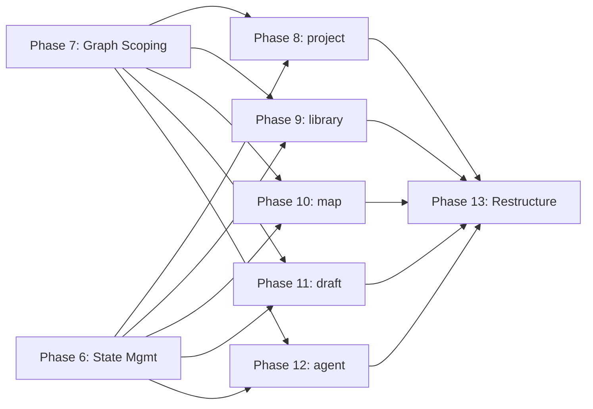

# Re:Search CLI — Execution Roadmap

## Goal

Transform the current flat CLI ([cli/main.py](file:///c:/Users/speee/.openclaw/workspace/Search/cli/main.py), 212 lines) into the **domain-oriented TUI** described in [DOCS_CLI_DESIGN.md](file:///c:/Users/speee/.openclaw/workspace/Search/docs/DOCS_CLI_DESIGN.md). The new CLI introduces 5 command groups (`project`, `library`, `map`, `draft`, `agent`), persistent state management, and graph-based project scoping — all wired to the existing backend (Phases 0–5 ✅).

### What Exists Today

| Layer | Status | Key Files |
|---|---|---|
| DB (nodes, edges, FTS, vector) | ✅ Complete | `backend/db/nodes.py`, `edges.py`, `search.py`, `models.py` |
| Scraper | ✅ Complete | `backend/scraper/fetcher.py`, `extractor.py` |
| RAG (chunker, embedder, ingestor) | ✅ Complete | `backend/rag/ingestor.py`, `pdf_ingestor.py` |
| Agent (LangGraph researcher) | ✅ Complete | `backend/agent/runner.py`, `graph.py` |
| FastAPI HTTP layer | ✅ Complete | `backend/api/routers/*.py` |
| CLI | ⚠️ Flat harness | `cli/main.py` — raw commands, no project scoping |

### What We're Building

The new CLI must implement:
1. **Persistent state** — `~/.research_cli/context.json` tracks the active project.
2. **`project`** — Workspace lifecycle (create, switch, list, status, export).
3. **`library`** — Context-aware ingestion and search (replaces `scrape`/`ingest`/`db search`).
4. **`map`** — Graph structure (show, connect, cluster).
5. **`draft`** — Artifact creation with external editor integration.
6. **`agent`** — Delegated research tied to the active project.
7. **Retire old commands** — Remove `db`, `scrape`, `ingest` top-level groups.

---

## Proposed Changes — Phased Execution

---

### Phase 6 — State Management & Context Layer

**Goal:** Build the persistence mechanism so all subsequent commands can know "Where am I?"

**Dependencies:** Phase 0 (project scaffold exists).

#### [NEW] `cli/context.py`

The stateful context module. Responsibilities:

- **`CliContext` dataclass:**
  ```
  active_project_id: str | None
  active_project_name: str | None
  user_preferences: dict  (editor_command, default_search_depth)
  ```
- **`load_context() -> CliContext`** — Read from `~/.research_cli/context.json`. Return defaults if file doesn't exist.
- **`save_context(ctx: CliContext) -> None`** — Write the dataclass to disk as JSON. Create `~/.research_cli/` dir if needed.
- **`require_context` decorator** — Wraps CLI commands that need an active project. Loads context, checks `active_project_id` is set, passes it to the function. Aborts with a clear error if no project is active.

#### [MODIFY] `backend/config.py`

Add a new setting:
```
cli_config_dir: Path  # defaults to ~/.research_cli
```

This gives the context module a single source of truth for the path.

#### [NEW] `tests/test_cli_context.py`

| Test | Assertion |
|---|---|
| `test_load_default_context` | Returns defaults when no file exists |
| `test_save_and_load_roundtrip` | Write → read produces identical `CliContext` |
| `test_require_context_without_project` | Decorator aborts when `active_project_id` is `None` |
| `test_require_context_with_project` | Decorator passes `project_id` to the wrapped function |

**Validation:**
```bash
pytest tests/test_cli_context.py -v
```

---

### Phase 7 — Backend Graph-Scoping Helpers

**Goal:** Add backend functions to support graph-based project scoping. A "Project" is a Node of type `Project`. Scoping means "find all nodes reachable from the project root within 1–2 hops."

**Dependencies:** Phase 1 (DB layer), Phase 6 (context knows the project ID).

#### [NEW] `backend/db/projects.py`

Domain-specific helpers that compose the generic `nodes.py` and `edges.py` primitives:

| Function | Signature | Purpose |
|---|---|---|
| `create_project` | `(conn, name: str) -> Node` | Create a Node of type `Project` |
| `list_projects` | `(conn) -> list[Node]` | `list_nodes(conn, node_type="Project")` |
| `get_project_nodes` | `(conn, project_id: str, depth: int = 2) -> list[Node]` | BFS/recursive query to fetch all nodes connected to the project root within `depth` hops |
| `get_project_summary` | `(conn, project_id: str) -> dict` | Count nodes by type, count edges, list recent artifacts |
| `link_to_project` | `(conn, project_id: str, node_id: str, relation: str = "HAS_SOURCE") -> None` | `connect_nodes(conn, project_id, node_id, relation)` |
| `export_project` | `(conn, project_id: str) -> dict` | Serialize project subgraph to a dict (nodes + edges) for JSON export |

> [!IMPORTANT]
> `get_project_nodes` is the critical function that enables scoping. It must walk the graph without hitting cycles (track visited node IDs). The SQL query can use a recursive CTE:
> ```sql
> WITH RECURSIVE reachable(id, depth) AS (
>     SELECT ?, 0
>     UNION ALL
>     SELECT e.target_id, r.depth + 1
>     FROM edges e JOIN reachable r ON e.source_id = r.id
>     WHERE r.depth < ?
> )
> SELECT DISTINCT n.* FROM nodes n JOIN reachable r ON n.id = r.id
> ```

#### [NEW] `tests/test_projects.py`

| Test | Assertion |
|---|---|
| `test_create_project` | Node created with `node_type == "Project"` |
| `test_list_projects` | Returns only Project-type nodes |
| `test_get_project_nodes_depth_1` | Returns directly connected nodes only |
| `test_get_project_nodes_depth_2` | Returns nodes 2 hops away |
| `test_get_project_nodes_no_cycle` | Graph with cycles doesn't infinite-loop |
| `test_link_to_project` | Edge created between project and target node |
| `test_export_project` | Output dict has `nodes` and `edges` keys |
| `test_get_project_summary` | Returns correct counts per type |

**Validation:**
```bash
pytest tests/test_projects.py -v
```

---

### Phase 8 — `project` Command Group

**Goal:** CLI commands for project lifecycle management.

**Dependencies:** Phase 6 + Phase 7.

#### [NEW] `cli/commands/project.py`

Typer sub-app `project_app`:

| Command | Action |
|---|---|
| `project new <name>` | Call `create_project(conn, name)`, update `context.json` to set as active |
| `project switch <name\|id>` | Lookup by name or ID, update `context.json` |
| `project list` | Call `list_projects(conn)`, print table |
| `project status` | Call `get_project_summary(conn, project_id)`, pretty-print dashboard |
| `project export` | Call `export_project(conn, project_id)`, write JSON to file |

> [!NOTE]
> `project switch` should support both name and UUID. Try UUID lookup first, fall back to exact name match on nodes of type `Project`.

#### [NEW] `tests/test_cli_project.py`

Use `typer.testing.CliRunner` to exercise each command:

| Test | Assertion |
|---|---|
| `test_project_new` | Creates project, sets context |
| `test_project_switch_by_name` | Switches context to named project |
| `test_project_list` | Output includes all projects |
| `test_project_status` | Summary includes source/artifact counts |
| `test_project_export` | Valid JSON file written to disk |

**Validation:**
```bash
pytest tests/test_cli_project.py -v

# Manual smoke test
python cli/main.py project new "Solid-State Batteries"
python cli/main.py project status
python cli/main.py project list
```

---

### Phase 9 — `library` Command Group

**Goal:** Context-aware ingestion and search. All operations auto-link to the active project.

**Dependencies:** Phase 7 (scoping helpers) + Phase 3 (RAG ingestor, already complete).

#### [NEW] `cli/commands/library.py`

Typer sub-app `library_app`:

| Command | Args / Flags | Action |
|---|---|---|
| `library add <target>` | `<url\|filepath>` | Detect URL vs file path. Call `ingest_url` or `ingest_pdf`. Then `link_to_project(conn, project_id, node.id, "HAS_SOURCE")` |
| `library search "<query>"` | `--mode fuzzy\|semantic\|hybrid`, `--global` | If `--global`: search all nodes. Else: restrict results to `get_project_nodes(conn, project_id)` |
| `library recall "<question>"` | | RAG query scoped to active project. Retrieve top-k chunks, format prompt, call LLM, print answer with source citations |
| `library list` | `--type Source\|Artifact\|...` | List nodes connected to the active project, optionally filtered by type |

#### Backend support needed (no new files, small additions):

#### [MODIFY] `backend/db/search.py`

Add a `node_ids: list[str] | None` parameter to `fts_search`, `vector_search`, and `hybrid_search`. When set, filter results to only those IDs (i.e., the project-scoped node set). Implementation: add `WHERE id IN (...)` clause.

#### [NEW] `backend/rag/recall.py`

RAG-based Q&A function:
- `recall(conn, question: str, project_id: str | None = None) -> str`
- Steps: (1) Get scoped node IDs via `get_project_nodes`, (2) Embed the question, (3) `hybrid_search` with node_ids filter, (4) format top-k chunks as LLM context, (5) call LLM with a "answer from sources" system prompt, (6) return formatted answer with source citations.

#### [NEW] `tests/test_cli_library.py`

| Test | Assertion |
|---|---|
| `test_library_add_url` | Source node created and linked to project |
| `test_library_add_pdf` | PDF node created and linked to project |
| `test_library_search_scoped` | Returns only nodes in active project |
| `test_library_search_global` | Returns nodes across all projects |
| `test_library_list` | Lists project-scoped nodes |
| `test_library_recall` | Returns LLM answer (mocked) with citations |

**Validation:**
```bash
pytest tests/test_cli_library.py -v

# Manual smoke test (requires active project)
python cli/main.py project new "Test Project"
python cli/main.py library add --target "https://en.wikipedia.org/wiki/LangGraph"
python cli/main.py library search --query "LangGraph" --mode fuzzy
python cli/main.py library list
```

---

### Phase 10 — `map` Command Group

**Goal:** Expose graph structure operations for the active project's "Crazy Board."

**Dependencies:** Phase 7 (scoping helpers).

#### [NEW] `cli/commands/map.py`

Typer sub-app `map_app`:

| Command | Args | Action |
|---|---|---|
| `map show` | `--format tree\|list` | Fetch `get_project_nodes(conn, project_id)` + edges. Render as ASCII tree (nodes as branches, relations as labels) or flat list |
| `map connect` | `<node_a> <node_b> --label "<relation>"` | `connect_nodes(conn, node_a, node_b, relation)`. Validate both nodes belong to the project |
| `map cluster` | | (Advanced) Call LLM with all project node titles/summaries, ask it to suggest thematic clusters and connections. Print proposed edges; optionally auto-apply with `--apply` flag |

#### ASCII tree renderer (helper):

#### [NEW] `cli/rendering.py`

Utility for rendering a project graph as ASCII:
- `render_tree(nodes: list[Node], edges: list[Edge], root_id: str) -> str`
- BFS from root, indent children, annotate with relation labels.
- Example output:
  ```
  📁 Solid-State Batteries
  ├── [HAS_SOURCE] 📄 Wikipedia: Solid-state battery
  ├── [HAS_SOURCE] 📄 ArXiv: 2106.09685
  │   └── [CITES] 📝 Electrolyte Comparison Notes
  └── [HAS_ARTIFACT] 📝 Report: State of SSBs
  ```

#### [NEW] `tests/test_cli_map.py`

| Test | Assertion |
|---|---|
| `test_map_show_tree` | Output contains project name and child nodes |
| `test_map_show_list` | Output contains flat list of nodes |
| `test_map_connect` | Edge created between two nodes |
| `test_map_connect_invalid_node` | Error when node not in project |

**Validation:**
```bash
pytest tests/test_cli_map.py -v

# Manual smoke test
python cli/main.py map show
python cli/main.py map connect <nodeA_id> <nodeB_id> --label "RELATED_TO"
```

---

### Phase 11 — `draft` Command Group

**Goal:** Create and edit artifact documents via the user's external editor.

**Dependencies:** Phase 7 (project linking), Phase 1 (node CRUD).

#### [NEW] `cli/commands/draft.py`

Typer sub-app `draft_app`:

| Command | Args | Action |
|---|---|---|
| `draft new "<Title>"` | | Create an `Artifact` node, `link_to_project(conn, project_id, node.id, "HAS_ARTIFACT")` |
| `draft edit <node_id>` | | The "Edit Loop": (1) Fetch node's `content_path` or `metadata.content` from DB, (2) Write to temp `.md` file, (3) Open `$EDITOR` (from context preferences or `$EDITOR` env var), (4) Wait for exit, (5) Read file, (6) Update node `content_path` and `updated_at` |
| `draft list` | | List artifacts linked to the active project |
| `draft attach <node_id> <source_id>` | | Create a `CITES` edge between an artifact and a source |
| `draft show <node_id>` | | Print the content of an artifact to stdout |

#### [NEW] `cli/editor.py`

The editor integration module (from [DOCS_CLI_DESIGN.md §4.3](file:///c:/Users/speee/.openclaw/workspace/Search/docs/DOCS_CLI_DESIGN.md#L145-165)):

- `edit_node_content(content: str, title: str = "draft", extension: str = ".md") -> str`
  - Uses `$EDITOR` env var, falls back to user preference in `context.json`, then to `notepad` (Windows) / `vim` (Unix).
  - Creates temp file in `~/.research_cli/drafts/` (not `/tmp`), named after the node title.
  - Calls `subprocess.call([editor, tf_path])`.
  - Reads back content after editor exits.
  - Does NOT delete the temp file (acts as local backup).

#### [MODIFY] `backend/db/nodes.py`

Add optional `content_body` field handling. Currently `content_path` exists but there's no mechanism to store inline content. Two options:
1. Store content in a file at `content_path` (preferred — matches design doc).
2. Store content in `metadata["content_body"]`.

Decision: **Use `content_path`**. The `draft edit` flow writes to `~/.research_cli/drafts/<node_id>.md` and sets `content_path` accordingly.

#### [NEW] `tests/test_cli_draft.py`

| Test | Assertion |
|---|---|
| `test_draft_new` | Artifact node created and linked to project |
| `test_draft_edit_roundtrip` | Content written to temp file, read back correctly (mock `$EDITOR` with a no-op) |
| `test_draft_list` | Shows only artifacts in active project |
| `test_draft_attach` | `CITES` edge created |
| `test_draft_show` | Prints content to stdout |

**Validation:**
```bash
pytest tests/test_cli_draft.py -v

# Manual smoke test
python cli/main.py draft new "Chapter 1"
python cli/main.py draft edit <node_id>  # Opens editor
python cli/main.py draft list
python cli/main.py draft show <node_id>
```

---

### Phase 12 — `agent` Command Group

**Goal:** Wrap the existing `run_research` function in a project-aware command that auto-links outputs.

**Dependencies:** Phase 4 (agent, already complete), Phase 7 (project linking).

#### [NEW] `cli/commands/agent.py`

Typer sub-app `agent_app`:

| Command | Args | Action |
|---|---|---|
| `agent hire --goal "<objective>"` | `--depth quick\|standard\|deep` | (1) Call `run_research(goal)`, (2) The report artifact is already created by `runner.py`, (3) Retrieve the artifact node, (4) `link_to_project(conn, project_id, artifact.id, "HAS_ARTIFACT")`, (5) Link all scraped URLs' source nodes to the project |
| `agent status` | | List all `Artifact` nodes in the project with `metadata.goal` set (i.e., agent-produced reports). Show creation time, goal, sources count |

#### [MODIFY] `backend/agent/runner.py`

Small enhancement: `run_research` should **return the artifact node ID** alongside the `ResearchState`, so the CLI can link it to the project. Current implementation creates the artifact but doesn't surface its ID to the caller.

Options:
1. Add `artifact_id` field to `ResearchState`.
2. Return a tuple `(ResearchState, artifact_id: str | None)`.

**Decision:** Add `artifact_id: str` to `ResearchState` TypedDict. Populate it after the `create_node` call in `runner.py`.

#### [MODIFY] `backend/agent/state.py`

Add `artifact_id: str` field (default `""`).

#### [NEW] `tests/test_cli_agent.py`

| Test | Assertion |
|---|---|
| `test_agent_hire` | Research runs (mocked), report linked to active project |
| `test_agent_status` | Lists agent-produced artifacts |

**Validation:**
```bash
pytest tests/test_cli_agent.py -v

# Manual smoke test (requires Ollama)
python cli/main.py project new "Battery Research"
python cli/main.py agent hire --goal "Summarise solid-state battery progress"
python cli/main.py agent status
python cli/main.py map show  # Report should appear in the tree
```

---

### Phase 13 — CLI Restructure & Cleanup

**Goal:** Wire all command groups into the main app and retire the old flat commands.

**Dependencies:** Phases 8–12.

#### [MODIFY] `cli/main.py`

Major rewrite:
1. **Remove** old command groups: `db_app`, `scrape`, `ingest_app`, `research`.
2. **Import and register** new sub-apps:
   ```python
   from cli.commands.project import project_app
   from cli.commands.library import library_app
   from cli.commands.map import map_app
   from cli.commands.draft import draft_app
   from cli.commands.agent import agent_app

   app.add_typer(project_app, name="project")
   app.add_typer(library_app, name="library")
   app.add_typer(map_app, name="map")
   app.add_typer(draft_app, name="draft")
   app.add_typer(agent_app, name="agent")
   ```
3. **Keep** a `db init` escape hatch for bootstrapping.
4. **Update** help text and app name.

#### [NEW] `cli/commands/__init__.py`

Empty package init.

#### [MODIFY] `README.md`

Update the CLI usage section to document the new command groups and example workflows.

**Validation:**
```bash
# Structural check
python cli/main.py --help
# Expected: project, library, map, draft, agent subcommands

# Full user journey smoke test
python cli/main.py project new "Paris 19ème"
python cli/main.py library add --target "https://en.wikipedia.org/wiki/Vidocq"
python cli/main.py library search --query "Vidocq"
python cli/main.py draft new "Vidocq Biography"
python cli/main.py draft edit <node_id>
python cli/main.py map show
python cli/main.py agent hire --goal "Find information about crimes in 19th century Paris"
python cli/main.py project status
python cli/main.py project export
```

---

## Dependency Graph



> [!TIP]
> Phases 6 and 7 are the foundation — they must be done first and in order. Phases 8–12 can be done **in parallel** since they only depend on 6 + 7. Phase 13 is the final integration pass.

---

## File Inventory

### New Files (14)

| File | Phase | Purpose |
|---|---|---|
| `cli/context.py` | 6 | State management (`context.json` read/write) |
| `cli/commands/__init__.py` | 13 | Package init |
| `cli/commands/project.py` | 8 | `project` command group |
| `cli/commands/library.py` | 9 | `library` command group |
| `cli/commands/map.py` | 10 | `map` command group |
| `cli/commands/draft.py` | 11 | `draft` command group |
| `cli/commands/agent.py` | 12 | `agent` command group |
| `cli/editor.py` | 11 | External editor integration |
| `cli/rendering.py` | 10 | ASCII tree renderer |
| `backend/db/projects.py` | 7 | Graph-scoping helpers |
| `backend/rag/recall.py` | 9 | RAG-based Q&A |
| `tests/test_cli_context.py` | 6 | Context layer tests |
| `tests/test_projects.py` | 7 | Graph scoping tests |
| `tests/test_cli_project.py` | 8 | Project command tests |
| `tests/test_cli_library.py` | 9 | Library command tests |
| `tests/test_cli_map.py` | 10 | Map command tests |
| `tests/test_cli_draft.py` | 11 | Draft command tests |
| `tests/test_cli_agent.py` | 12 | Agent command tests |

### Modified Files (5)

| File | Phase | Change |
|---|---|---|
| `backend/config.py` | 6 | Add `cli_config_dir` setting |
| `backend/db/search.py` | 9 | Add `node_ids` filter param to search functions |
| `backend/agent/state.py` | 12 | Add `artifact_id` field |
| `backend/agent/runner.py` | 12 | Surface `artifact_id` in return state |
| `cli/main.py` | 13 | Replace old commands with new sub-apps |
| `README.md` | 13 | Updated CLI documentation |

---

## Verification Plan

### Automated Tests

Every phase has a dedicated test file. Run the full suite with:
```bash
pytest tests/ -v --tb=short
```

All tests mock external dependencies (LLM, Ollama, network). No test requires a running Ollama/OpenAI instance.

### Manual Smoke Tests

After Phase 13, run the full user journey from the [CLI Restructure section](#phase-13--cli-restructure--cleanup). This exercises the end-to-end flow from project creation through research to export.

### Regression

The existing 114 backend tests (`test_db.py`, `test_scraper.py`, `test_rag.py`, `test_agent.py`) must continue to pass after all changes:
```bash
pytest tests/test_db.py tests/test_scraper.py tests/test_rag.py tests/test_agent.py -v
```

---

## Key Design Decisions

| Decision | Rationale | Risk |
|---|---|---|
| Graph-based scoping (not a `project_id` column) | Matches design doc; uses existing edges table; no schema migration | Recursive CTE performance on large graphs (mitigated by depth limit) |
| `context.json` as flat JSON file | Simple, human-readable, no new dependency | Concurrent CLI processes could race (mitigated: single-user tool) |
| Content stored at `content_path` (not inline) | Keeps DB row small; large docs don't bloat SQLite | Must manage file lifecycle alongside node deletion |
| Temp drafts in `~/.research_cli/drafts/` not `/tmp` | Persistent backup; survives reboots | Disk usage grows; add a `draft clean` command later |
| `require_context` decorator pattern | DRY — avoids repeating "load context, check project" in every command | Decorator magic can obscure control flow; document clearly |
